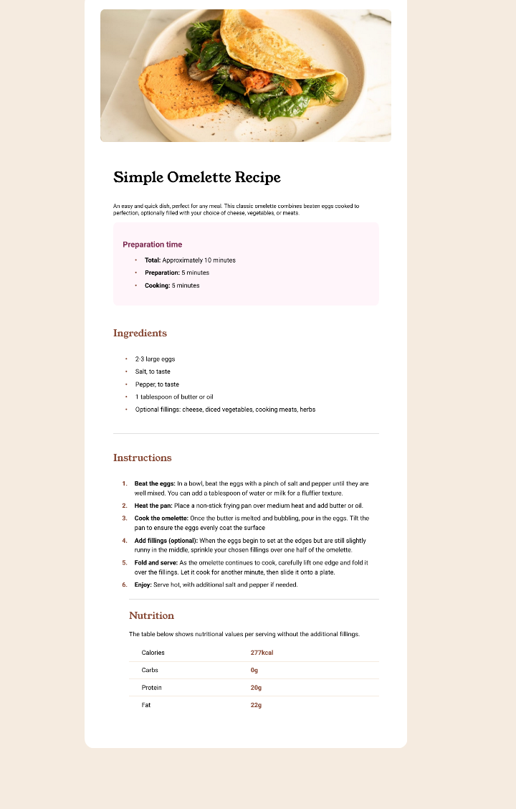

# Frontend Mentor - Recipe page solution

This is a solution to the [Recipe page challenge on Frontend Mentor](https://www.frontendmentor.io/challenges/recipe-page-KiTsR8QQKm). Frontend Mentor challenges help you improve your coding skills by building realistic projects. 

## Table of contents

- [Overview](#overview)
  - [Screenshot](#screenshot)
  - [Links](#links)
- [My process](#my-process)
  - [Built with](#built-with)
  - [What I learned](#what-i-learned)
  - [AI Collaboration](#ai-collaboration)
- [Author](#author)
- [Acknowledgments](#acknowledgments)


## Overview

### Screenshot



### Links

- Solution URL: [Spck Editor](https://spck.io/editor)
- Live Site URL: [GitHub pages](https://ghod-zilla12.github.io/recipe-page/)

## My process

### Built with

- Semantic HTML5 markup
- CSS
- Framework
- Mobile-first workflow
- React
- Typography

### What I learned

I learnt how to design the box and also adding different font styles to my code as well as the different headers. I also learnt how to style different part of a table (code below) including list bullets and numbers using CSS.

```css
td:last-child {
  padding-right: 32px;
  padding-left: 16px;
  color: var(--text-brown);
  font-weight: 700;
}
```

### AI Collaboration

At some point in this challenge I was frustrated and AI was a good advantage for me in this. I leveraged it by using Chatgpt, Google Gemini, meta AI and other AI tools to brainstorm this challenge and ask some vital questions on areas I found difficult.

- I used tools like Chatgpt, GitHub copilot, Google Gemini.
- I used them to debug and brainstorm.
- How AI works for everyone depends on how well you can leverage them, for me there was no issue at all using these tools to my advantage.

## Author

- Frontend Mentor - [Ghod-Zilla12](https://www.frontendmentor.io/profile/Ghod-Zilla12)
- Facebook - [Zilla Lla](https://www.facebook.com/profile.php?id=61574520025702)

## Acknowledgments

I'll like to appreciate God for strength, then myself for not throwing in the towel.
